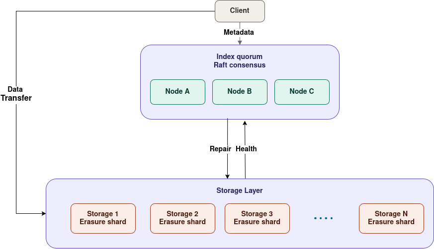

# Arkel

Arkel is object storage pooled together by the community. It aims to serve as a reliable Object store alternative to Cloud Corporations. 



Full design: [architecture overview](https://amr8t.github.io/arkel-site/architecture/overview).

## Install

```sh
curl -fsSL https://amr8t.github.io/arkel-site/install.sh | sh
arkel --help```

## Quickstart

## As an operator

Run a **storage node** to contribute disk and get quota:

```sh
arkel storage \
  --addr 0.0.0.0:9001 \
  --index-addrs http://index.example:8001 \
  --data-dir /var/lib/arkel/storage
```

- `--addr` — the QUIC endpoint to bind (default `127.0.0.1:9001`)
- `--index-addrs` — index node URLs to register against
- Identity is auto-generated on first boot into `--data-dir/identity.key`.

Run an **index node** (part of the Raft metadata quorum):

```sh
arkel index \
  --http-addr 0.0.0.0:8001 \
  --peer-addresses <pubkey@ip:port,...>
```

## As a user

```sh
# put
arkel client put photo.jpg --bucket media --key holidays/1.jpg

# get
arkel client get media holidays/1.jpg --output photo.jpg

# rm
arkel client rm media holidays/1.jpg
```

Erasure coding means the network survives node failures — no single node holds
your data in the clear, and your data is encrypted before it leaves your
machine.


## License

AGPL-3.0. See [LICENSE](LICENSE).
